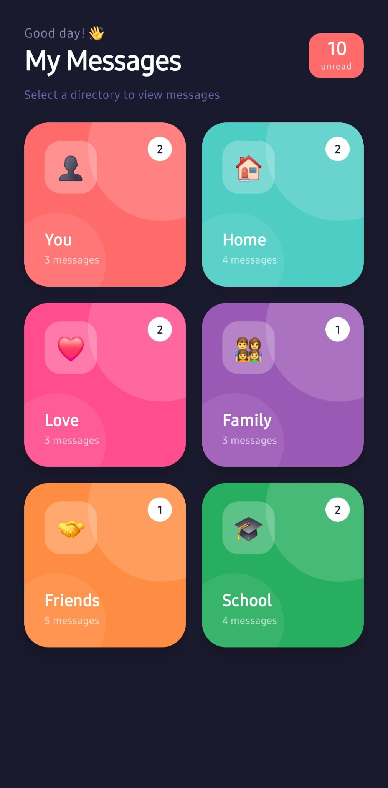

# 📱 Message Directory App
### CS5450 — Mobile Programming | Exercise 3
**Dr. Sabah Mohammed · Department of Computer Science · Lakehead University**

---

## 📌 Overview

A **React Native** message directory application built with **Expo** and **TypeScript**. The app displays six category directories — You, Home, Love, Family, Friends, and School — as an animated grid. Tapping any category navigates to its message list, and tapping a message opens a full chat-style detail view with a reply input.

---

## 📸 Screenshots

| Home Screen | Messages Screen | Detail Screen |
|:-----------:|:---------------:|:-------------:|
|  |  |  |

---

## ✨ Features

- 🗂️ **6 Message Categories** — You, Home, Love, Family, Friends, School
- 🎨 **Dark Theme** — Deep navy background (#1A1A2E) with per-category accent colours
- ✨ **Animations** — Spring + fade entry animations using React Native's Animated API
- 🔴 **Unread Badges** — Per-category unread count on grid cards and message list
- 💬 **Chat View** — Full message bubble detail screen with sent/received bubbles
- ⌨️ **Reply Input** — Functional TextInput with keyboard avoidance (iOS & Android)
- 🔷 **TypeScript** — Full type safety throughout the codebase

---

## 🗂️ Project Structure

```
MessageDirectory/
├── App.tsx                          # Entry point
├── app.json                         # Expo configuration
├── package.json                     # npm dependencies
├── tsconfig.json                    # TypeScript config
├── babel.config.js                  # Babel preset
├── assets/                          # Icons and splash screen
│   ├── icon.png
│   ├── splash.png
│   ├── adaptive-icon.png
│   └── favicon.png
└── src/
    ├── data/
    │   └── messages.ts              # All category & message data
    ├── navigation/
    │   └── AppNavigator.tsx         # React Navigation stack setup
    └── screens/
        ├── HomeScreen.tsx           # 2x3 animated category grid
        ├── MessagesScreen.tsx       # Message list per category
        └── MessageDetailScreen.tsx  # Chat detail view + reply input
```

---

## 🛠️ Tech Stack

| Technology | Version |
|------------|---------|
| React Native | 0.74.0 |
| Expo SDK | ~51.0.0 |
| TypeScript | ~5.3.3 |
| React Navigation | ^6.1.17 |
| React Navigation Native Stack | ^6.9.26 |
| React Native Screens | ~3.31.1 |
| React Native Safe Area Context | 4.10.1 |

---

## 🚀 Getting Started

### Prerequisites
- [Node.js](https://nodejs.org) v18 or higher
- [Expo CLI](https://docs.expo.dev/get-started/installation/) — `npm install -g expo-cli`
- [Android Studio](https://developer.android.com/studio) with Android SDK API 34

### Installation

**1. Clone the repository**
```bash
git clone https://github.com/omavaiya4/MessageDirectory4.git
cd MessageDirectory4
```

**2. Install dependencies**
```bash
npm install
```

**3. Start the development server**
```bash
npx expo start
```

**4. Run on Android Emulator**
- Open Android Studio → Device Manager → Start an AVD
- Press **`a`** in the Expo terminal to launch on the emulator

---

## ⚙️ Android Environment Setup

**Windows** — Add these to System Environment Variables:

| Variable | Value |
|----------|-------|
| `ANDROID_HOME` | `C:\Users\YourName\AppData\Local\Android\Sdk` |
| `Path` (add) | `%ANDROID_HOME%\platform-tools` |
| `Path` (add) | `%ANDROID_HOME%\emulator` |

**macOS/Linux** — Add to `~/.zshrc` or `~/.bashrc`:
```bash
export ANDROID_HOME=$HOME/Library/Android/sdk
export PATH=$PATH:$ANDROID_HOME/emulator
export PATH=$PATH:$ANDROID_HOME/platform-tools
```

---

## 📱 Navigation Flow

```
HomeScreen
    └── MessagesScreen (on category tap)
            └── MessageDetailScreen (on message tap)
```

| Screen | Description |
|--------|-------------|
| **HomeScreen** | 2×3 animated grid of category cards with unread badges |
| **MessagesScreen** | Scrollable message list with unread indicators |
| **MessageDetailScreen** | Chat bubble view with functional reply input |

---

## 👨‍💻 Author

**Student** — CS5450 Mobile Programming  
**Institution** — Lakehead University  
**Professor** — Dr. Sabah Mohammed  

---

## 📄 License

This project was created for academic purposes as part of CS5450 Mobile Programming at Lakehead University.
